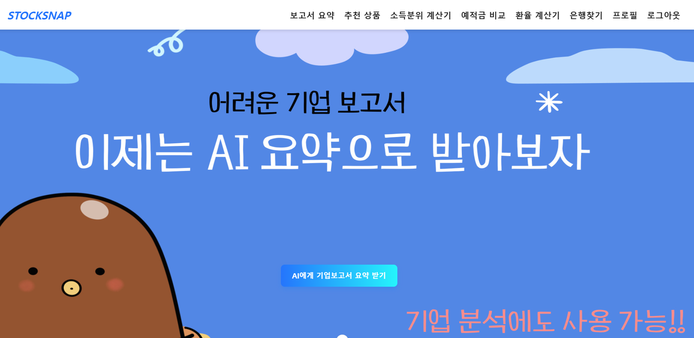

### 금융 상품 비교 애플리케이션
#  STOCKSNAPS

### 목차
1. [🙋 팀원 정보 및 업무 분담 내역](#팀원-정보-및-업무-분담-내역)
2. [📊 설계 내용 (아키텍처 등) 및 실제 구현 정도](#설계-내용-아키텍처-등-및-실제-구현-정도)
3. [📑 데이터베이스 모델링(ERD)](#데이터베이스-모델링erd)
4. [💻 금융 상품 추천 알고리즘에 대한 기술적 설명](#금융-상품-추천-알고리즘에-대한-기술적-설명)
5. [💁 서비스 대표 기능들에 대한 설명](#서비스-대표-기능들에-대한-설명)
6. [🙇 느낀 점, 후기 등](#느낀-점-후기-등)

## 팀원 정보 및 업무 분담 내역
- 프로젝트 기간 : 2023/11/16 ~ 2023/11/24 (약 9일)

|이름|역할 및 구현 기능|
|---|---|
|이건욱 |Front End - figma, 회원가입, 로그인, 마이페이지, 홈, 금융 상품 비교, 환율 계산기, 주변 은행 검색, 게시판 CRUD, 상품 관리, 상품 추천 Back End- 유저 프로필 수정 기능, 금융 상품 정보 저장 |
|이상혁 |Back End - 소득분위 계산기, GPT 기반 DART 보고서 요약 기능, ERD, 회원 커스터마이징, 환율 정보 저장 및 업데이트, 금융 상품 정렬 및 필터링, 금융 상품 회원 저장 |

## 설계 내용 (아키텍처 등) 및 실제 구현 정도
## 💻Tech Stack

### Language

    python
    javascript

### Back-end

    Django
    Django-rest-framework
    

### Front-end

    Vue3
    vuetify
    pinia
    axios
    chart.js

## 📊ERD

### ERD

## ⚙금융 상품 추천 알고리즘에 대한 기술적 설명

저희 알고리즘은 ***다양한 사용자의 정보를 기반***으로 현재 사용자의 정보와 유사한 ***조건의 사용자들이 많이 가입한 금융 상품***들을 내림차순으로 보여줍니다.

최소 10000명의 유저가 가입된 STOCKSNAPS에서는 모든 사용자의 금융 정보를 기반으로 내 금융 정보 맞춤 상품 10개를 추천합니다.
1. 사용자가 폼에 나이, 연봉, 현재자산 등의 정보를 선택하면, 해당 정보는 axios를 통해 Django 서버로 전송되어 API에 전달됩니다.
2. 서버에서는 전달받은 정보를 기반으로 조건문을 활용하여 데이터베이스에서 필터링을 수행합니다. Q 객체를 사용하여 작성된 조건문은 해당 정보와 일치하는 유저들의 가입 상품을 필터링합니다.

### 1. 내 나이대의 사용자들을 위한 추천 받기

사용자가 회원가입 시 입력한 나이를 기반으로 상품을 추천합니다. STOCKSNAPS 내 같은 나이 대의 유저들이 가장 많이 가입한 상품 10개를 추천합니다.

### 2. 나의 금융 정보와 비슷한 금융 정보를 가진 유저들이 가입한 상품 추천받기

 최소 10000명의 유저가 가입된 STOCKSNAPS에서는 모든 연령대에서 가장 많이 가입한 상품 5개를 추천합니다.

이렇게 구현된 알고리즘은 사용자의 정보와 다른 유저들의 선택을 비교하여 가장 많은 유저들이 가입한 금융상품을 추천해주는 기능을 수행합니다.

## 보고서 요약에 대한 기술적 설명

### 개발한 계기

취준생 입장에서 다양한 회사에 지원하게 되다보면 해당 회사의 사업에 대해 공부를 해야합니다. 그 과정에서 겪는 문제점들은 다음과 같습니다.

1. DART에 들어가서 검색 -> 회사명으로 검색이 안될시 종목코드를 검색해야함

2. 정기 공시 보고서를 읽고 정리

### 문제점 해결 로직 

따라서 위의 문제점을 해결하기 위해

1. 종목코드명이 아닌 회사명만으로 정기보고서 검색가능

2. 가장 최근 정기 공시보고서를 gpt-3.5 turbo를 통해 요약

을 하는 알고리즘을 DART API, OPENAI API를 사용하여 취준생의 고충을 덜고자 개발하게 되었습니다.

## 소득분위 계산기에 대한 기술적 설명

### 개발한 계기

국가에서 주는 혜택들(ex. 국가장학금, 청년적금)등은 보통 중위소득을 기반으로 혜택의 여부가 갈리게 됩니다.
그럴때마다 소득분위 계산법 찾기도 힘들고 표를 봐도 내가 몇 분위인지 한번에 알아보기 힘듭니다.

### 문제점 해결 로직

1. 중위소득표는 매년 달라지기 때문에 보건복지부에서 받은 표를 하드코딩하여 중위 100% 로 설정

2. 100%를 기준으로 연봉과 가구원수를 입력받아 해당 고객이 몇 %에 속하는지 확인

3. 퍼센트 값이 나오면 해당 고객이 몇 분위인지 출력

## 서비스 대표 기능들에 대한 설명

### 1️⃣ 메인 페이지

- 주요 서비스 소개 카드를 누르면 각 서비스에 대한 소개글 토글
- 토스뱅크에서 아이디어를 얻어 밑으로 스크롤하면 해당 기능으로 이동할 수 있는 버튼 생성

### 2️⃣ 로그인, 회원가입 페이지

- 로그인 실패 시 에러메세지를 띄워 사용자로 하여금 아이디와 비밀번호를 다시 확인할 수 있오록 하였습니다.
- 아이디는 영어 대소문자와 숫자만 이루어진 5글자 이상으로, 이메일은 이메일 형식으로, 비밀번호는 8~16자의 영어 대소문자, 숫자, 특수문자로 이루어져 있는지 확인하였고, 마지막으로 아이디, 이메일, 닉네임은 중복방지 등의 꼼꼼한 유효성 검사를 진행하였습니다.

### 3️⃣ 프로필

- 마이페이지에서 프로필이미지(Default 이미지 설정), 나이, 자산, 연봉 등의 회원 정보를 확인하고 수정할 수 있습니다.
- 내가 가입한 상품 탭에서는 기존에 가입했던 상품들의 리스트를 확인하고 상품들의 상세 정보와 가입 해지 등을 할 수 있습니다. 또한, 우대조건 및 추가설명을 한 눈에 확인할 수 있게 하였습니다.

### 4️⃣ 예적금 비교 페이지

- 금융 상품 비교 페이지에서는 정기 예금 페이지, 정기 적금 페이지의 두 개의 탭으로 나누어지고 은행명으로 검색할 수 있는 창을 설정했습니다. 
- 정기 예금 및 적금 페이지에서는 모든 정기 예금 및 적금에 대한 간략한 정보를 테이블에서 확인할 수 있고 각 상품을 3D 카드 애니메이션 효과로 적용하였습니다.
- 상품 카드의 가입하기 버튼을 누르게 되면 우대 조건, 만기 후 이율, 추가 설명등 더 자세한 설명이 나오며 가입하기 버튼을 한 번 더 누르면 프로필 - 내가 가입한 상품에서 확인 가능합니다.

### 5️⃣ 환율 계산기 페이지

- 환율 계산 페이지에서는 통화를 선택후 외화 기준, 원화 기준으로 환율 계산이 가능합니다.

### 6️⃣ 은행 찾기 페이지

- 주변 은행 검색 페이지에서는 직접 광역시/도, 시/군/구를 선택하여 은행명을 입력하면 해당 은행들의 지점명까지 표기 됩니다.

## 🎡작업 

## 11월 18일(월)

- 사이트 전체 기획 및 ERD 작성
- 컴포넌트 구조 생성
- django model 구축
- 업무 분담 및 메인 페이지 기본 틀 구현

**문제점 개선 및 논의 사항**

우선 필수과제 및 구현하고 싶은 기능들의 명세서를 대략적으로 작성
프론트와 백을 나누어 작업하자고 합의
GPT 프롬프팅

---

## 11월 19일(화)

- 메인페이지 작성 및 로그인, 로그아웃, 회원가입 코드 작성
- 백엔드의 로그인, 로그아웃, 회원가입 코드와 vue를 연동하여 페이지에 렌더링

**문제점 개선 및 논의 사항** 

잘 되는 것 확인하고 귀가
---

## 11월 20일(수)

- 현재까지 작성한 백엔드 코드 재작성
- axiosError로 다시한번 pinia에 대해 학습 후 재연동(성공)

**문제점 개선 및 논의 사항** 

1. 인증을 받는 Authorization을 JWT 토큰식으로 작성했던 것을 깨달음
2. DRF, SPA 방식이 아니라 기능 구현에 초점을 맞춘것을 깨달음
--> 백엔드 코드 다 엎고 다시 시작

---

## 11월 21일(목)

- 백엔드 : 환율 계산기 구현
- 프론트 : 백엔드에서 코드를 받아 렌더링 할 페이지들 스켈레톤 코드 구현

**문제점 개선 및 논의 사항**
1. 한국 수출입은행 API가 오전에 되다가 오후에 뻗어버리는 상황 발생
-> 처음엔 코드 오류인줄 알고 4시간동안 코드 디버깅
알고봤더니 API 자체오류여서 다른 친구 API 키 가져와서 활용
---

## 11월 22일(금)

- 백엔드 : 보고서 요약 알고리즘 구현
- 프론트 : 환율계산기 페이지 백엔드로 받아온 로직을 렌더링

**문제점 개선 및 논의 사항**

1. DART와 OPENAI API 를 사용하여 보고서를 파일에 다운받는 와중에 
XML로 데이터를 받고 JSON으로 출력해야하는데 인코딩 불가
2. API 명세를 보고 XML로 받기로 결정하고 DB에 보고서 저장 후 GPT에게 넘겨 요약
-> GPT4로 모델을 실행할 경우 TEXT가 너무 길어 요약 불가 -> gpt-3.5 turbo로 변경
3. 요약본을 DB에 저장하여 화면에 출력
---

## 11월 23일(토)

- 백엔드에서 로직 및 DB 구현을 하고 프론트와 연결하는 과정이 너무 힘들자 각자 기능별로 백엔드 + 프론트엔드 구현하기로 협의
- 하루동안 진행하고 무언가 잘못됨을 느끼고 다시 분업화

**문제점 개선 및 논의 사항**

지금까지 서로 백엔드, 프론트엔드를 맡아 일을 진행하다보니 각자 분야에 너무 익숙해져버림
-> 따라서 문제가 생겼을때 같이 백 or 프론트에서 문제가 터지는지 확인하고 담당자가 문제 해결
백과 프론트가 같이 가면 시간이 너무 오래 걸려서 더미 데이터를 쓰기로 함

---

## 11월 24일(일)

- 금융상품 추천알고리즘 구현
- 프로필 이미지 변경했을때 사진 바로 반영 및 DB에 저장
- 예적금 가입하기 누르면 DB에 저장하여 다른곳에서도 호출 가능하게 

- 사이트 디자인 시작 : 디자인 상의 컨셉 상의
    - 메인 페이지 틀 수정 및 컴포넌트 재생성
    - 회원관리 기능 관련 페이지 css
    

**문제점 개선 및 논의 사항**

1.  vue 컴포넌트에서 style 태그에 css를 정의했을때, 전역에 적용됨 → scoped 속성을 추가
2. 동일 페이지로 router push 하는 경우 에러발생

---

## 11월 25일(월)

- 전체 폰트 및 색상 통일
- 예적금 상품 조회 및 추천 기능 css : 카드 컴포넌트 디자인
- 게시글, 댓글에 대한 css 규격 통일

 **문제점 개선 및 논의 사항**

컴포넌트 개수가 급증 but 미리 폴더 구조를 구조적으로 만들어두지 않아 어려움 있음. → 현 상황에서 수정이 어렵다고 판단, 폴더 구조를 새로 만들지는 x

---

## 11월 26일(화)

- 사용자 편의 목적 및 추가 확장 고려해 ‘환율 조회 및 계산’ 기능 추가
- 예적금 상품 추천 : 기존 알고리즘 + 최고 우대 금리 정렬 구현
- 사이트 전반적인 css 세부사항 조정 및 오탈자 확인

**문제점 개선 및 논의 사항**

1. 회원 인증 기능에서 사용자가 잘못된 정보 입력 시 사용자에게 알려주는 기능 누락
2. 다른 페이지로 이동이 가능한 요소들 중 cursor가 pointer 되지 않는 부분들 수정 필요

→ 수정 완료

# 느낀 점 및 추후 개발시 주목할 점

### 이상혁
평소에 개발하고 싶었던 기능들이 있었지만 막상 도전해본다는 것이 무서워 구현을 하지 못하고 있었습니다. 하지만 이번 프로젝트 덕분에 완벽하진 못하지만 구현을 해보게 되었습니다. 그 과정에서 SSAFY에서 배운 내용들대로 해보기도 하고, 평소에 체감이 잘 되지않았던 API 명세서, 공식문서, ERD 작성 등 직접 문제와 부딪치면서 어떤 구조로 동작되는지 몸소 느끼게 되었습니다.

### 이건욱
자신의 실력을 간과하고 그저 화려하게만 하려고 하다 아무것도 구현되지 않고 저의 실력을 다시한번 알게되는 계기였습니다. 그래서 싸피의 수업시간에 배우지 않았던 하지만 이번 프로젝트에서 필요로 했던 vuetify같은 라이브러리나 최대한 만족스러운 효과를 내기 위해 css를 구글링을 통해 틈틈이 공부하는 등 실전을 통해 실력을 키울 수 있는 좋은 경험이었습니다.

이번 프로젝트를 월말평가용 프로젝트로 끝내지 않고 계속해서 개발하기 위해 저희 프로젝트의 문제점 및 개선방안을 간략하게 기록하고자 합니다.

1. Backend/views.py에 모든 기능을 다 넣어 1300줄 이상의 코드 발생하여 유지보수 불가
-> 추후에 기능별로 나누어 작성

2. ERD 작성 문제 : SQLD를 공부했음에도 정규화 및 반정규화 지식이 부족하여 너무 많은 테이블 발생
-> 각 기능별로 꼭 필요한 테이블만 생성하여 최대한 서로 참조하여 관계 형성 

3. 각 기능들마다 구현 디테일 부족
: 데이터 전처리를 제대로 하지 못하여 보고서 요약 기능, 소득 분위 계산기, 환율 계산기에서 오차 발생. 그로 인해 UI/UX 저하
-> 도메인 지식을 더 공부하여 오차가 발생하지 않게 꼼꼼한 로직 작성

4. 추후에 배포 진행
